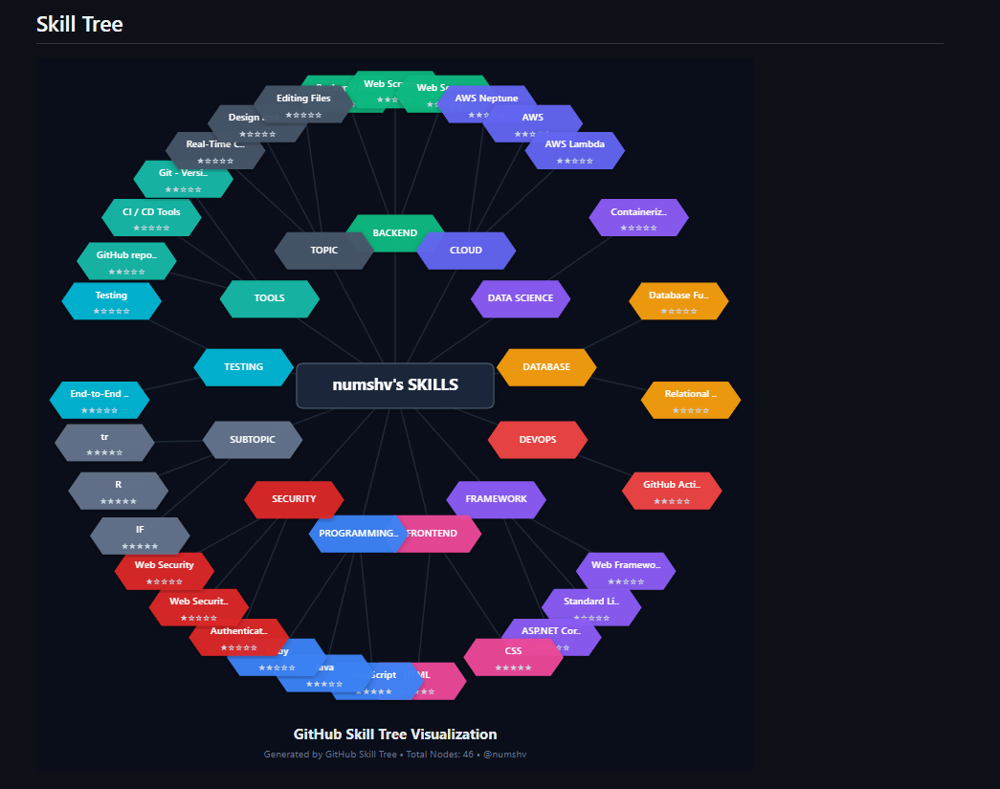

# 🌳 GitHub Skill Tree Generator



> Transform your GitHub repos into an skill tree

## ⚡ Quick Start

``` markdown

```

## ✨ Features
- Auto-detect skills from repos
- Beautiful SVG visualization
- Roadmap.sh integration

## 📚 Documentation
Full docs: https://numshv.gitbook.io/numshv-docs/

## 🚀 Try It
Add to your profile README now!

## ⭐ Star Us
If you find this useful, give us a star!
